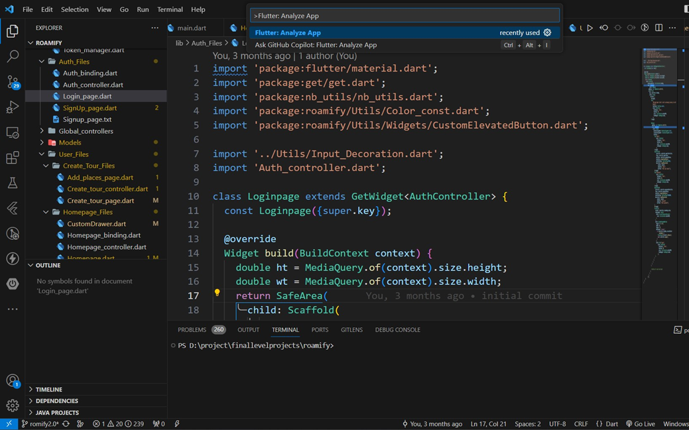
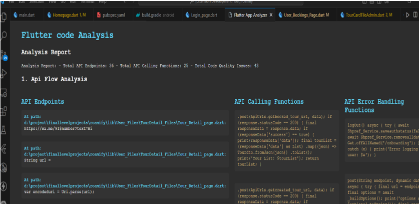
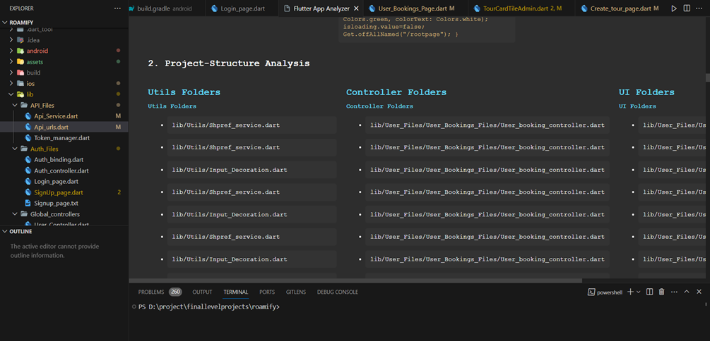
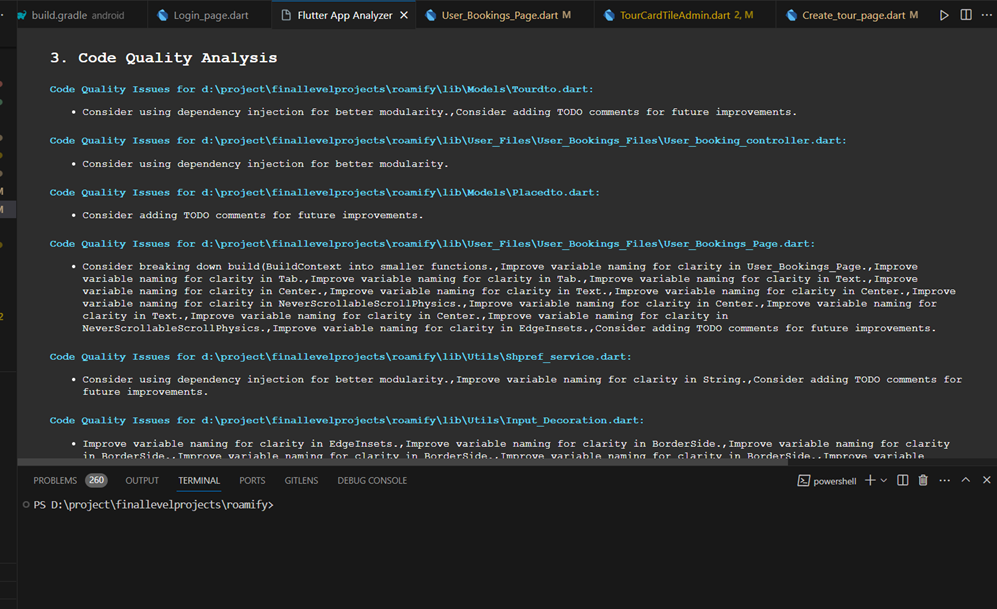

# flutter-analyzer-extension README

##For whome these extension is built?
The target audience includes a developer/team whose goal is to work on a new codebase or want to update functionality in an existing project.With the help of this tool, they can easily identify the structure of the code base, ApiFlow along with Suggestions of new Features

## Features
•	Detect and analyze ApiFlow with Api-end-points.
•	Analyze Project Structure.
•	Analyze code quality.
•	Generate a report summarizing the analysis results.
•	Generate a prompt suggesting a way to extend the code.
•	Provides  Developer-Friendly experience. 

## How to Use
• Press (ctrl+shift+p) then the search and select command
  “Flutter: Analyze App” as given below.

  

## Output Analysis  

  

  

  

## Note
• Right now it is built to analyze flutter framework only.

### 1.0.0

Initial release 

## Following extension guidelines

Ensure that you've read through the extensions guidelines and follow the best practices for creating your extension.

* [Extension Guidelines](https://code.visualstudio.com/api/references/extension-guidelines)

## Contributing

We welcome contributions! If you find a bug, have a feature request, or want to contribute in any way, please check our Gitub Repo: https://github.com/theshubh007/wise-analyst.

## For more information
For support or inquiries, please contact us at shubhamkothiya007@gmail.com.
Also you can connect with me at: https://www.linkedin.com/in/shubham-kothiya/

